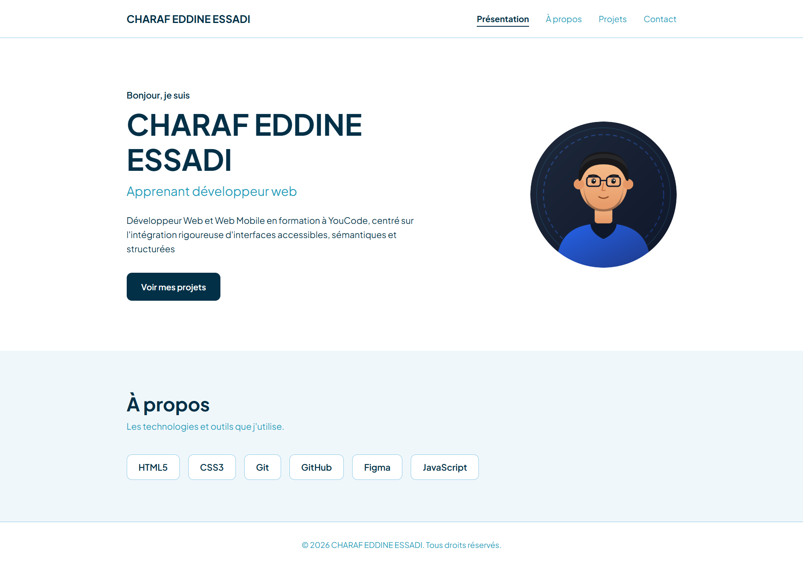
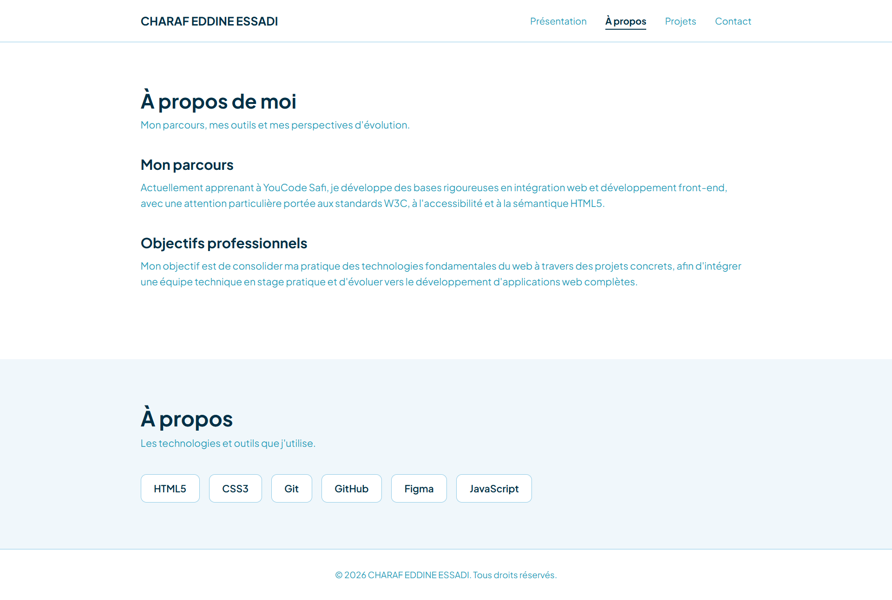
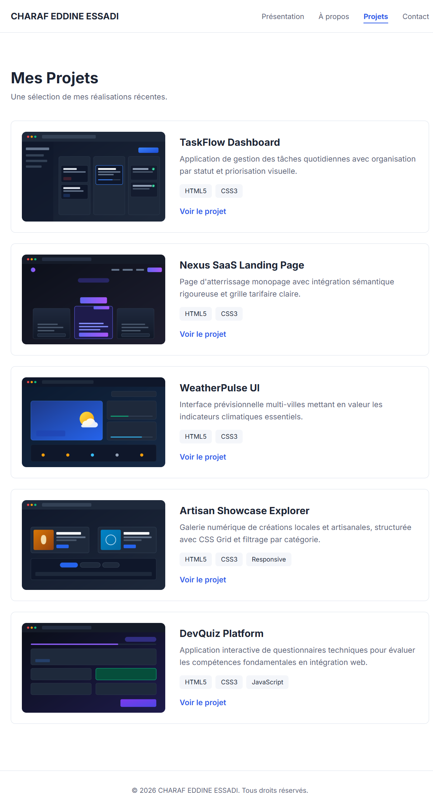
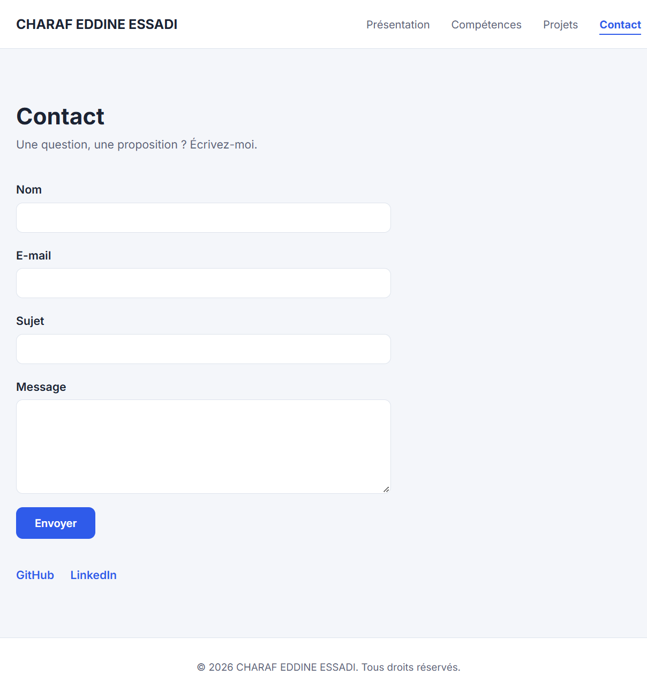

# Portfolio Personnel — CHARAF EDDINE ESSADI

Refactorisation et intégration sémantique d'un modèle de portfolio monopage vers une architecture multi-pages (4 pages distinctes) respectant les normes W3C, l'accessibilité et la mise en page responsive.

---

## 🔗 Maquette Figma

- **Lien du prototype :** [Consulter la maquette Figma en mode lecture](https://www.figma.com/design/DQs8Wh2eRHsDKVL88BDbUe/Portfolio-Personnel-%E2%80%94-CHARAF-EDDINE-ESSADI?node-id=0-1&t=QkSTZK20nDRdoP3S-1)

---

## 📋 Présentation du Projet

Ce projet s'inscrit dans le cadre du premier brief à YouCode Safi. L'objectif principal consistait à décomposer un code de départ monopage pour construire un site statique structuré, sémantiquement rigoureux et prêt pour l'intégration web :

- **Validation W3C :** Documents HTML testés et validés sans erreurs ni avertissements sur Nu Html Checker.
- **Feuille de style centralisée :** Utilisation d'un fichier unique `css/style.css` exploitant variables CSS, Flexbox et dispositions en grille.
- **Accessibilité et bonnes pratiques :** Renseignement systématique d'attributs `alt` pertinents, association stricte des balises `<label>` avec leurs champs, et hiérarchisation cohérente des titres (`h1` puis `h2`).

---

## 🛠️ Changements apportés au modèle initial

### 1. Structure et Navigation

- **Découpage en 4 pages :** Séparation du flux unique en 4 fichiers HTML autonomes (`index.html`, `a-propos.html`, `projets.html`, `contact.html`).
- **Refonte de la barre de navigation :** Remplacement des ancres internes (`#projets`, `#contact`) par des liens inter-pages absolus.
- **Gestion de l'état actif :** Ajout de la classe `.actif` sur le lien correspondant à la page courante pour orienter l'utilisateur.
- **Conteneur principal :** Encapsulation systématique du corps de chaque page à l'intérieur de la balise structurante `<main>`.

### 2. Évolution des Pages et du Contenu

- **Page Accueil (`index.html`) :** Conservation de la présentation personnelle, mise en valeur du titre principal et liaison directe vers la page des réalisations via le bouton d'action.
- **Création de la page À propos (`a-propos.html`) :**
  - Intégration d'un volet décrivant le parcours d'apprentissage.
  - Déplacement et réorganisation de la section **Compétences** (HTML5, CSS3, Git, GitHub, Figma, JavaScript).
  - Ajout d'une section dédiée aux objectifs professionnels et à la recherche de stage.
- **Page Projets (`projets.html`) :**
  - Ajout de 2 réalisations supplémentaires (total porté à 5 projets : _TaskFlow Dashboard_, _Nexus SaaS_, _WeatherPulse UI_, _Artisan Showcase Explorer_, _DevQuiz Platform_).
  - Remplacement des descriptifs d'images génériques par des alternatives textuelles détaillées.
  - Ajustement typographique dans `css/style.css` pour harmoniser la taille des titres de projets (`.projet h2, .projet h3 { font-size: 22px; }`) avec la maquette Figma.
- **Page Contact (`contact.html`) :**
  - Ajout du champ obligatoire **Sujet** (`<input id="sujet" name="sujet" type="text" required>`).
  - Typage strict du champ email (`type="email"`) et application de l'attribut `required` sur l'ensemble des champs.
  - Sécurisation des liens vers les profils externes (GitHub, LinkedIn) avec `target="_blank"` et `rel="noopener"`.

---

## 📸 Captures d'écran des 4 pages

### 1. Page d'Accueil (`index.html`)

### 2. Page À propos (`a-propos.html`)

### 3. Page Projets (`projets.html`)

### 4. Page Contact (`contact.html`)

---

## 💻 Technologies mobilisées

- **HTML5** (Balisage sémantique : `header`, `nav`, `main`, `section`, `article`, `footer`)
- **CSS3** (Variables CSS, Flexbox, sélecteurs d'état)
- **Figma** (Prototypage d'interfaces et conception UI)
- **Git & GitHub** (Contrôle de version et historique conventionnel des commits)
